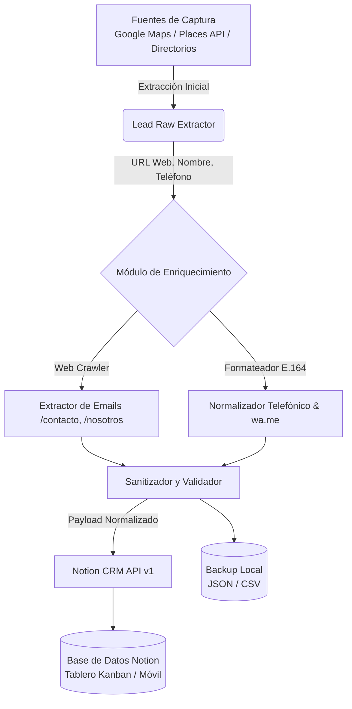

# 📐 Documentación Técnica de Arquitectura

**Proyecto:** Sistema de Captura de Leads y CRM en Notion  
**Fecha:** Septiembre 2026  
**Objetivo:** Especificación técnica del pipeline de prospección y gestión de clientes.

---

## 1. Arquitectura General del Sistema

---

## 2. Especificación del Esquema de Datos (Notion CRM Database)

La base de datos en Notion (`CRM - Captura de Clientes`) está configurada con las siguientes propiedades:

| Campo Notion | Tipo de Propiedad | Opciones / Formato | Descripción |
|---|---|---|---|
| **Nombre** | `title` | Texto | Nombre comercial del estudio o empresa. |
| **Estado** | `select` | 📥 Nuevo Lead *(Azul)* 📞 Contactado *(Amarillo)* 💬 En Conversación *(Naranja)* 📑 Propuesta Enviada *(Morado)* 🎉 Ganado / Cliente *(Verde)* ❌ Descartado *(Gris)* | Etapa en el embudo de ventas (permite vista Kanban). |
| **Teléfono** | `phone_number` | Ej: `+51 979 649 678` | Número principal con formato internacional. |
| **WhatsApp** | `url` | Ej: `https://wa.me/51979649678` | Enlace clickeable para abrir chat instantáneo en el móvil. |
| **Email** | `email` | Ej: `contacto@estudio.pe` | Correo electrónico directo para prospección. |
| **Sitio Web** | `url` | Ej: `https://estudio.pe` | Página web o enlace a red social principal. |
| **Ciudad** | `select` | Chiclayo, Piura, Lima, etc. | Ciudad base del lead. |
| **Rubro** | `select` | Arquitectura & Diseño, etc. | Sector económico o nicho comercial. |
| **Dirección** | `rich_text` | Calle, Número, Urbanización | Ubicación física para visitas presenciales. |
| **Notas** | `rich_text` | Texto libre | Observaciones, teléfonos alternativos, servicios destacados. |

---

## 3. Pipeline de Enriquecimiento y Normalización (`lead_capture.py`)

### 3.1 Normalización Telefónica (Perú)
* **Celulares**: Detecta secuencias de 9 dígitos que comienzan en `9` (o 11 dígitos con prefijo `519`) y los formatea a `+51 9XX XXX XXX`.
* **Fijos (Chiclayo)**: Detecta números de 6 u 8 dígitos (con código de área `074` o `74`) y formatea a `(074) XXXXXX`.

### 3.2 Generación de WhatsApp
Convierte cualquier celular peruano al enlace estandarizado `https://wa.me/519XXXXXXXX`, permitiendo iniciar conversación sin guardar el número en la agenda telefónica.

### 3.3 Extracción Automatizada de Correos
* Visita la página web del prospecto con cabeceras que simulan un navegador moderno.
* Escanea etiquetas de contacto (`mailto:`) y texto plano con expresiones regulares:
  $$\text{Regex: } [a-zA-Z0-9_.+-]+@[a-zA-Z0-9-]+\.[a-zA-Z0-9-.]+$$
* Descarta falsos positivos comunes (`.png`, `.jpg`, librerías como Sentry o Wix).

---

## 4. Estrategia de Migración Futura

Si en el futuro se desea migrar a otro CRM (HubSpot, Salesforce, Pipedrive o base de datos PostgreSQL):
1. **Exportación Nativa:** Notion permite exportar la base de datos completa con un clic a formato **CSV** o **Markdown**.
2. **Exportación vía API:** El método `list_leads()` de `notion_crm.py` extrae todos los registros con su ID y estados en JSON en pocos segundos.
3. **Compatibilidad:** La estructura de campos fue diseñada alineada con los estándares de HubSpot (`firstname`, `company`, `phone`, `email`, `lifecyclestage`), lo que hace que una migración sea un mapeo 1:1 directo.
