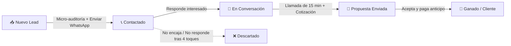

# 🎯 Playbook del Funnel de Prospección B2B
### Guía Práctica de Conversión de Leads para Arquitectos, Diseñadores y Constructoras

Este documento es tu **hoja de ruta paso a paso** para convertir los contactos fríos que el sistema deposita en tu Notion en **reuniones y clientes de pago**.

---

## 🧠 Psicología del Prospecto (Arquitectos y Constructoras)

Antes de enviar cualquier mensaje, comprende a quién le estás escribiendo:
1. **Tienen orgullo creativo:** Están enamorados de sus diseños, planos y obras. Si alabas un proyecto específico, te prestarán atención.
2. **Odian el spam genérico:** Mensajes tipo *"Hola, somos una agencia y ofrecemos..."* son ignorados o bloqueados en el acto.
3. **Están saturados de obra:** El dueño del estudio suele estar entre reuniones con clientes y supervisión en obra. Tu mensaje debe leerse en **15 segundos** y tener **baja fricción de respuesta**.

---

## 📊 Las 5 Etapas del Embudo en tu Notion

Cada vez que trabajes en tu Notion, mueve las tarjetas en tu vista de Tablero:

1. **📥 Nuevo Lead:** Recién extraído por el loop automático de GitHub Actions. Nadie le ha escrito.
2. **📞 Contactado:** Ya le enviaste el Mensaje 1 por WhatsApp o Email. En espera de respuesta.
3. **💬 En Conversación:** Ha respondido. Estás dialogando para entender sus necesidades y agendar una llamada.
4. **📑 Propuesta Enviada:** Tuvieron la llamada de diagnóstico y le enviaste una propuesta o cotización formal.
5. **🎉 Ganado / Cliente:** Aceptó el trato y pagó.
6. **❌ Descartado:** No cualifica o rechazó la oferta (anota siempre el motivo en la columna *Notas* de Notion para aprender).

---

## 💬 Guiones de Prospección por WhatsApp (Copy & Paste)

### Paso 0: La Micro-Auditoría de 60 segundos
Antes de enviar el mensaje:
1. Abre la ficha del lead en Notion.
2. Toca su enlace de **Sitio Web** o búscalos en Instagram en 1 minuto.
3. Encuentra **un detalle real**: el nombre de un proyecto que hayan publicado, un estilo que dominen (ej. casas de playa, edificios multifamiliares, diseño minimalista) o la zona donde construyen.

---

### 🟢 Guión 1: El Enfoque de "Reconocimiento de Proyecto" (Recomendado - Mayor tasa de respuesta)

> *"Hola [Nombre o 'Equipo de ' + Nombre del Estudio], buenas tardes.  
> Estaba revisando sus proyectos en [Chiclayo / Lambayeque], especialmente el trabajo que hicieron en [mencionar un proyecto de su web/redes o 'sus proyectos residenciales']. Me pareció de muy buen gusto el manejo de los acabados y el diseño.  
> 
> Te escribía puntualmente porque estamos colaborando con estudios de la zona para [mencionar el beneficio de tu servicio, ej: optimizar renders fotorrealistas / acelerar presupuestos / conseguir clientes para obras privadas].  
> 
> ¿Actualmente estás tú a cargo de la coordinación de nuevos proyectos o con quién de tu equipo podría comentar una consulta breve de 2 minutos? Un saludo."*

---

### 🟢 Guión 2: El Enfoque de "Pregunta Rápida de Capacidad" (Baja fricción)

> *"Hola [Nombre del Estudio], ¿cómo estás?  
> Te escribe [Tu Nombre]. Una consulta rápida: ¿actualmente en el estudio están tomando nuevos proyectos de [diseño / remodelación / consultoría] en [Ciudad] o están a capacidad completa este trimestre?  
> 
> Te consulto porque tengo un tema puntual que me gustaría plantearles si tienen disponibilidad. ¡Gracias!"*

*¿Por qué funciona?* A ningún arquitecto le gusta decir que no tiene capacidad de trabajo; despierta curiosidad inmediata sin sonar como vendedor invasivo.

---

## 🔁 La Cadencia de Seguimiento (El Dinero Está en el Follow-Up)

El 70% de las ventas B2B no se cierran en el primer mensaje, sino en el seguimiento amable. Si no responden, sigue esta secuencia cambiando la fecha en la propiedad **Próximo Seguimiento** de Notion:

| Día | Acción | Mensaje Sugerido |
|---|---|---|
| **Día 1** | Mensaje 1 (WhatsApp) | Guión 1 o Guión 2. |
| **Día 3** | Toque 2 (Bump Amigable) | *"Hola [Nombre], ¿cómo estás? Te reenvío esto por si se te pasó entre tantas obras y planos. ¿Pudiste darle un ojo al mensaje anterior? Un saludo."* |
| **Día 7** | Toque 3 (Aporte de Valor) | *"Hola [Nombre], justo me acordé de tu estudio porque vi este [recurso / idea / caso de éxito similar] y pensé que te sería útil para los proyectos que tienen en marcha. ¿Cómo viene tu semana?"* |
| **Día 14** | Toque 4 (Despedida Elegante) | *"Hola [Nombre], asumo que estás a tope de entregas y con la agenda completa, totalmente comprensible. No quiero ser insistente, así que no te molesto más por ahora. Si más adelante necesitas apoyo con [tu servicio], aquí me tienes a un mensaje de distancia. ¡Muchos éxitos con las obras!"* |

> **Dato Clave:** El mensaje de despedida del Día 14 suele rescatar entre un 20% y 30% de prospectos que responden diciendo: *"¡Mil disculpas, estaba en obra! Cuéntame de qué se trata..."*.

---

## 📞 Estructura de la Llamada de Cierre (15 Minutos)

Cuando un lead te diga *"Cuéntame más"* o *"Coordinemos una llamada"*:
1. **Minutos 0 a 3 (Rapport):** Habla de su trayectoria, pregúntale por sus proyectos en Chiclayo o su especialidad.
2. **Minutos 3 a 8 (Diagnóstico):** Pregunta por sus dolores:
   * *¿Qué es lo que más tiempo te quita hoy en día en el estudio?*
   * *¿De dónde suelen llegarles la mayoría de clientes actualmente?*
3. **Minutos 8 a 12 (Tu Solución):** Explica exactamente cómo resuelves ese dolor.
4. **Minutos 12 a 15 (Cierre):** Define el siguiente paso claro (envío de propuesta formal y fecha de inicio).

---

## 📈 Rutina Diaria del Vendedor (Solo 20 Minutos al Día)

1. **Mañana (9:00 AM):** Abres Notion en el móvil.
2. **Filtras por:** `Próximo Seguimiento = Hoy` o revisas 5 tarjetas de `📥 Nuevo Lead`.
3. **Envías 5 WhatsApps nuevos** con el botón directo de Notion.
4. **Haces los seguimientos pendientes** (Día 3 o Día 14).
5. Mueves las tarjetas según corresponda. ¡En menos de media hora mantienes tu embudo activo generando oportunidades todos los días!
